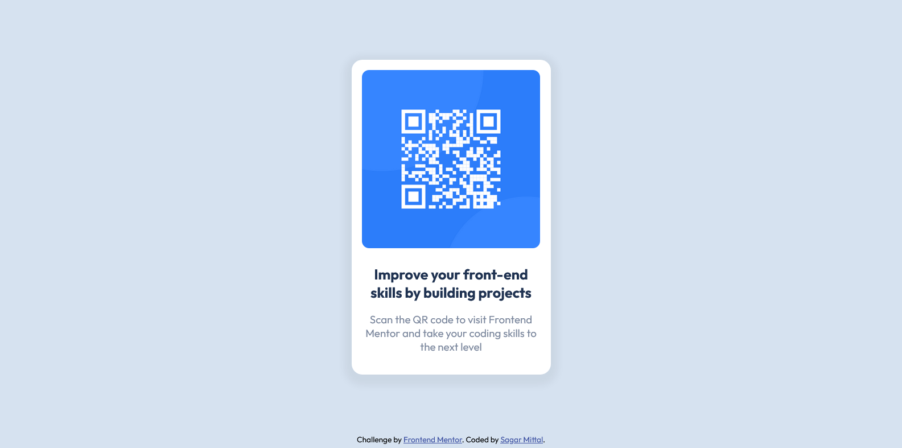

# Frontend Mentor - QR code component solution

This is a solution to the [QR code component challenge on Frontend Mentor](https://www.frontendmentor.io/challenges/qr-code-component-iux_sIO_H). Frontend Mentor challenges help you improve your coding skills by building realistic projects. 

## Table of contents

- [Overview](#overview)
  - [Screenshot](#screenshot)
  - [Links](#links)
- [My process](#my-process)
  - [Built with](#built-with)
  - [What I learned](#what-i-learned)
  - [Continued development](#continued-development)
  - [Useful resources](#useful-resources)
- [Author](#author)

**Note: Delete this note and update the table of contents based on what sections you keep.**

## Overview

### Screenshot

### Links

Live Site URL: [https://sagarmittal1.github.io/qr-code-component/](https://sagarmittal1.github.io/qr-code-component/)

## My process

### Built with

- Semantic HTML5 markup
- CSS custom properties
- Flexbox

### What I learned

I was lacking in handling images so I understand this now & managed to make this.

### Continued development

I need to learn more about Flexbox & start more exploring it. This is a basic design so, further developments are not that possible.

### Useful resources

- I used some website to find exact box shadow that is in design

## Author

- Website - [Sagar Mittal](https://sagarmittal.vercel.app)
- Frontend Mentor - [@sagarmittal1](https://www.frontendmentor.io/profile/sagarmittal1)
- Twitter - [@sagar_mittal5](https://www.twitter.com/sagar_mittal5)
